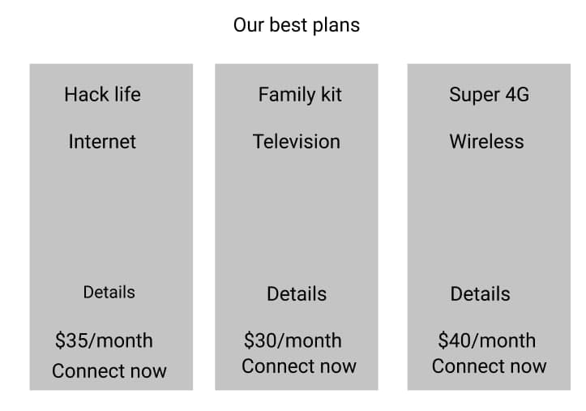
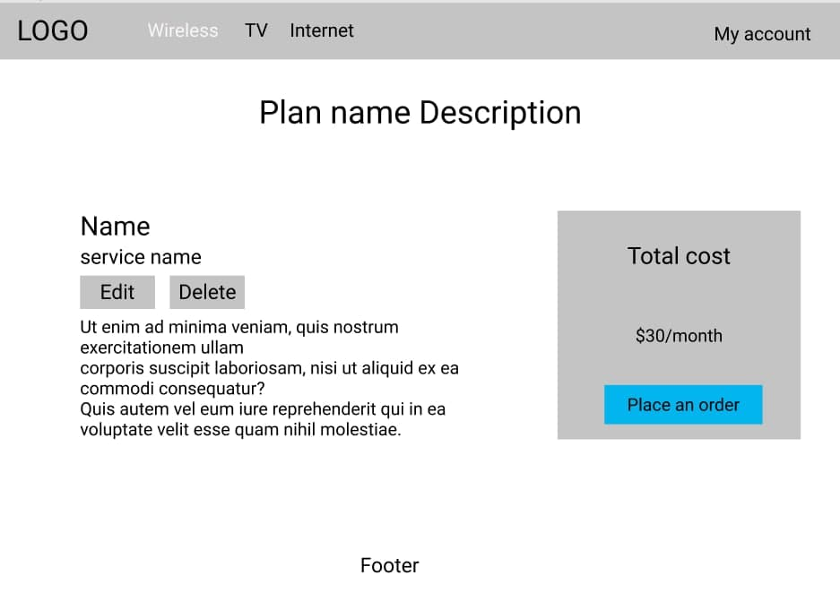
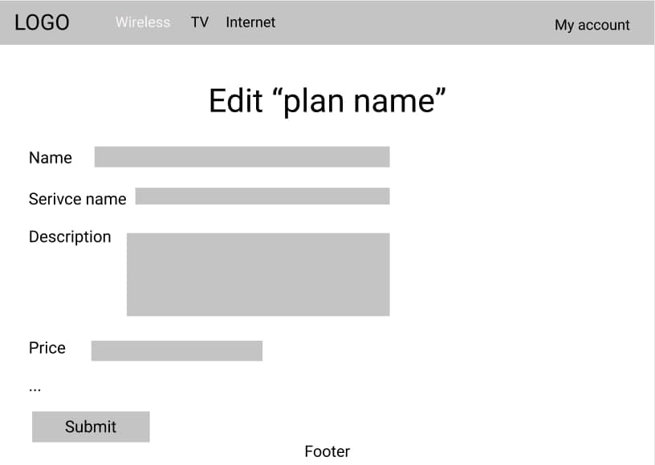
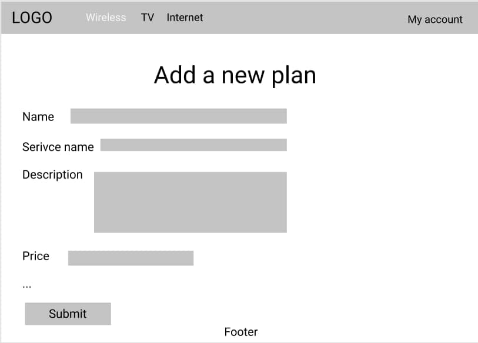
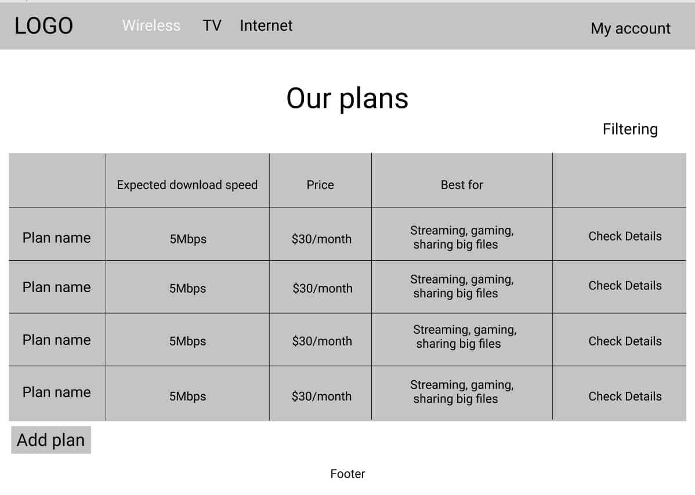

# Internet Provider

### Vision

"Internet Provider" is a web-application which allows customers to choose plans 
for provided services(Wireless, Internet, TV) pay online and check their bills.

Application should provide:
- Storing customers, plans and accounts in a database;
- Display list of plans;
- Filtering by an alphabet and price for plans;
- Make customers to be able to choose plans for provided services;
- Tie an account, that can be replenished, for each customer;
- Withdraw money from an account by the system depending on the plans selected 
  by the customer;
- Block the customer if there's not enough money on the account;
- Automatically unblock the customer after he replenishes his account 
  for the required amount; 
  ***only for admins***
- Updating the list of plans(adding, editing, removing);
- Updating the customer's info(blocking, unblocking)

## 1. Plan
### 1.1 Display list of the best plans on the main page
The mode is designed to show hot plans on the main page.

####***Main scenario***:
- Customer goes to the main page;
- Application renders best plans.

 
Pic. 1.1 View the best plans

The plan displays the following info:
- Name of the plan
- Name of the service it belongs to
- Link to the plan detail page(Details)
- Price
- Link to the page where a customer can leave his request(Connect now)

### 1.2 Display details of a plan

The mode is designed to view more details about a particular plan.

#### ***Main scenario:***
- A customer clicks on 'Check Details' on the page of service plans or 'Details' near
  a needed plan on the main page;
- Application shows a page.

 
Pic 1.3 View description of a plan

The page displays a plan name, a service name, a plan description and 
a total cost panel where you can press a 'Place an order' button, and an application
will redirect a customer to the order page.

### 1.3 Edit a plan(*only for admins*)

The mode is designed to view a form to edit the plan.

#### ***Main scenario***
- An admin goes to plan detail page;
- Clicks an Edit button;
- Application shows a form with passed info, that can be changed.
- After user press a submit button, model saves with new values and 
  user is redirected to plan details page.

 
Pic 1.4 View form for editing a plan

Form displays all plan model's fields with already filled information. 
A user can change everything he wants.

### 1.4 Delete a plan(*only for admins*)

#### ***Main scenario:***
- An admin goes to plan detail page;
- Clicks a Delete button;
- Application deletes a plan, and an admin is redirected to main page.

### 1.5 Add a new plan(*only for admins*)

#### ***Main scenario:***
- An admin goes to service plans page;
- Clicks an Add plan button;
- Application shows a form for creating a new plan. 
  After the admin submits a form, new form is created,
  and the admin is redirected to its page.
  
 
Pic 1.5 View form for adding a new plan

## 2. Service

### 2.1 Display all available plans for a particular service

The mode is designed to view the list of all available plans for the chosen service
and sort plans alphabetically and by price.

#### ***Main scenario:***
- User clicks on a link to the service page on a navbar;
- Application displays list of plans.

 
Pic. 1.2 View plans by a service(columns name may differ from service to service)

The list displays the following columns:
- Expected download speed - internet speed, that can vary;
- Price - plan's price for a month;
- Best for - the best suitable actions for this plan;
- The last column is for a link to a detail page of the plan;

#### ***Sorting***
- Above the table is the button, after pressing it there's a dropdown menu, 
  where a user can choose a way to sort data;
- If the user choose a-z, then the list will be sorted in a-z order, 
  if the user choose z-a, then the list will be sorted in z-a order,
  if the user choose price, then the list will be sorted by price;
  
## 3. 